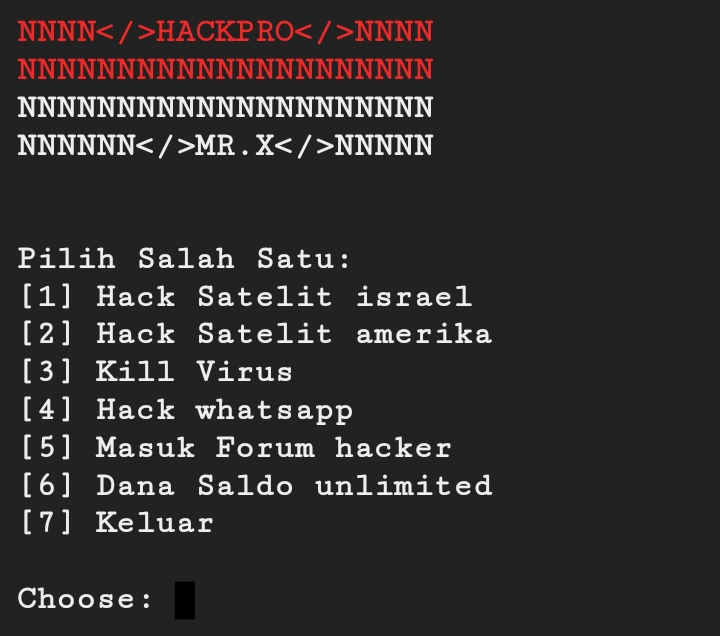

# HACKPRO


## introduction
HACKPRO is a script created to carry out hacking activities professionally and for real

## Instalations
```
$ pkg update -y && pkg upgrade -y
$ apt update -y && apt upgrade -y
$ pkg install git bash
$ git clone https://github.com/Whomrx666/HACKPRO.git
$ cd HACKPRO
$ bash HACKPRO.sh
```

## Instructions
- **First**: Install tools according to the instructions above 
- **Second**: Select one of the options available in the tools
- **Last**: The tools will carry out hacking according to your choice

## Warning!
Don't install it on your device :)

## Observation
This is a tool for education only, do not believe anyone
### Original Author
<a href="https://github.com/Whomrx666"></a>

### <<< If you copy , Then Give me The Credits >>>

## CONNECT WITH ME :

[](https://whomrxhackers.blogspot.com/)
[](https://twitter.com/whomrx666)
[](https://wa.me/6285926601133?text=Halo%2C%20Mr.X)
[](https://www.facebook.com/whomrx.666)
[](https://t.me/Whomr_X)
[](mailto:whomrx666@gmail.com)
[](https://www.tiktok.com/@whomr.x)

**If you want to donate, click on the button**
<a href="https://saweria.co/whomrx"></a>

---

<p align="left">
  
</p>

---